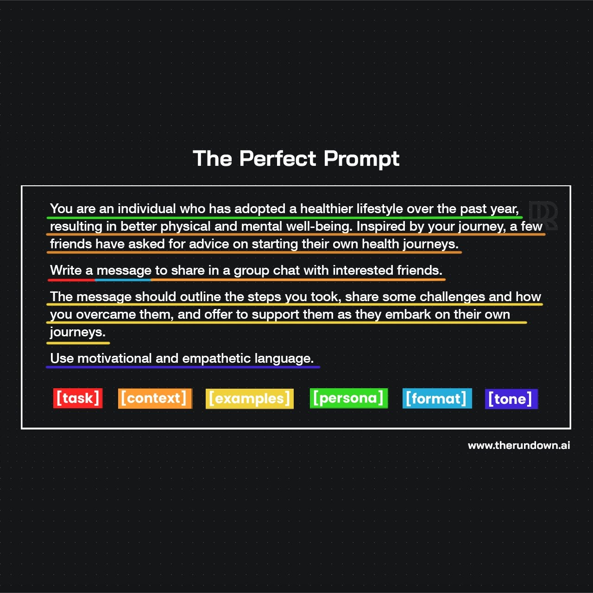

# Sample Blog Post

This is a sample blog post content written in Markdown. It includes some basic elements like headings, paragraphs, and images.

## Introduction

Markdown is a lightweight markup language with plain text formatting syntax. It's easy to write and read, making it a popular choice for writing blog posts.

## Main Content

Here is an example of a text paragraph in Markdown. It can contain **bold** text, *italic* text, and even [links](https://example.com).

### Subheading

You can create subheadings to organize your content better. This makes it easier for readers to follow along.

#### Sub-subheading

Markdown also supports nested headings, which can be used to create a hierarchical structure in your content.

## Conclusion

Markdown is a simple yet powerful tool for writing content. It allows you to focus on your writing without worrying about formatting.

Thank you for reading this sample blog post!
